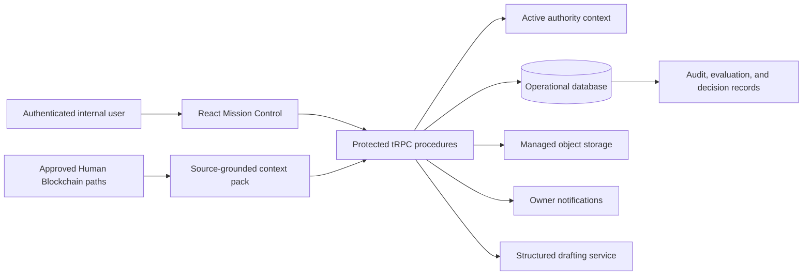

# DH Mission Control Documentation

> **DH Mission Control is a full-stack internal web application.** It is not a static mockup. The application combines authenticated access, a React interface, server-protected tRPC procedures, a MySQL/TiDB operational database, managed object storage references, notification delivery, and an audit-ready synthetic pilot workflow.

## Purpose and release boundary

DH Mission Control is the first control-plane pilot for the DH Manus Operating System. It makes a bounded **Lead → Task → Evidence → Review → Founder Decision** loop visible, reviewable, and traceable. The current release is intentionally internal and **synthetic-only**. It supports preparation, documentation, testing, independent review, and human decisions; it does not execute live financial, regulated, external-communication, production-access, or other consequential actions.

## Documentation map

| Document | Primary audience | Use it for |
|---|---|---|
| [User guide](user-guide.md) | Founder, internal operators, reviewers | Navigating the dashboard and completing permitted pilot workflows. |
| [Operator runbook](operator-runbook.md) | System owner and technical operator | Managing access, local operation, migrations, notifications, and incident triage. |
| [Architecture and data reference](architecture-and-data.md) | Developers and architects | Understanding components, data domains, procedure contracts, retrieval, storage, and auditability. |
| [Safety and change control](safety-and-change-control.md) | Founder, decision owners, governance reviewers | Applying the synthetic-only boundary, authorization rules, human gates, and controlled improvement process. |
| [Testing and release guide](testing-and-release.md) | Developers and release owners | Validating changes before a checkpoint, review, or publication decision. |
| [Documentation traceability matrix](traceability.md) | Maintainers and reviewers | Verifying documentation claims against the implementation, tests, and pilot safeguards. |
| [Pilot manual](../mission-control-pilot-manual.md) | All contributors | Reviewing the governing purpose, glossary, scope, and acceptance criteria. |

## System at a glance

The root [`README.md`](../../README.md) provides a concise project summary. This folder is the detailed operational reference for the application itself.
