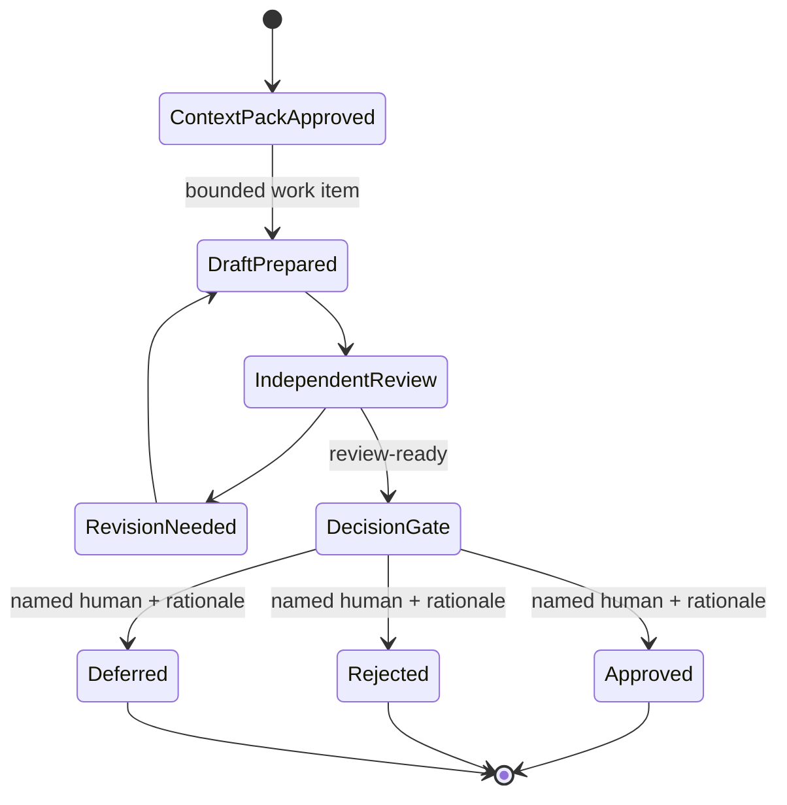

# Architecture and Data Reference

## Architectural intent

The application is a **modular monolith** designed to validate one governed internal loop before adding a cloud computer, durable worker, external integration, broader retrieval system, or distributed agent fleet. This reduces the number of permission, data, operational, and recovery boundaries that must be trusted during early learning.

## Component model

| Layer | Implemented responsibility | Key locations |
|---|---|---|
| Client | Authenticated internal dashboard, protected-workspace navigation, state messaging, and form controls. | `client/src/pages/MissionControl.tsx`, `client/src/components/DashboardLayout.tsx` |
| Shared policy | Input schemas, allowlist, synthetic-only constraints, readiness calculation, human-decision rules, and alert eligibility. | `shared/missionControl.ts` |
| Server service | Pilot initialization, context selection, dashboard aggregation, workflow records, draft/review preparation, safety scan, and audit writes. | `server/missionControl.ts` |
| Server contract | Protected tRPC procedure inventory and Zod input enforcement. | `server/routers/missionControl.ts` |
| Identity | Managed OAuth user session and user-role record. | `server/_core/`, `drizzle/schema.ts` |
| Operational data | Synthetic mission, provenance, review, decision, risk, evaluation, notification, and audit records. | `drizzle/schema.ts` |
| Object storage | File bytes uploaded outside the relational database; database records contain metadata and storage references. | `server/storage.ts` |
| Built-in services | Owner notification and structured server-side drafting integration. | `server/_core/notification.ts`, `server/_core/llm.ts` |

## Request and authority path

1. An authenticated user opens a protected Mission Control route.
2. The client calls a `protectedProcedure` through tRPC.
3. The server obtains the authenticated user, ensures pilot records exist, and retrieves that user’s active context.
4. The server confirms that the context is synthetic-only and that the user is authorized for the requested record/action.
5. The server validates the request input, performs the constrained operation, and emits appropriate audit and notification records.
6. The client renders the result, a loading state, an ordinary error state, or an authorization-denied state. The client cannot override the server’s pilot boundary.

## Data domains

| Domain | Purpose | Key controls |
|---|---|---|
| Authority | Organizations, legal entities, stakeholder groups, user contexts, and human roles. | Context belongs to the authenticated user; active context must be synthetic-only. |
| Readiness | Stack components and experiments. | Used for overview; not authorization. |
| Requirements | Source-linked questions, answers, status, priority, and architecture deltas. | Retains decision rationale as durable project knowledge. |
| Missions | Bounded mission, work item, artifact contract, acceptance criteria, and owner. | Work remains synthetic-only and reviewable. |
| Retrieval | Context packs and context-pack sources. | Repository paths must be allowlisted; source status is retained; proposals are distinct. |
| Evidence | File-reference metadata and object-storage key/URL. | No file bytes in the relational database; uploads are synthetic-only. |
| Assurance | Reviews, evaluations, risks, decisions, decision gates, notifications, and audit events. | Human gates and independent review protect state progression. |

## Context-pack model

The context pack is the boundary between the Human Blockchain knowledge library and new work. The application does not ingest the whole repository into every prompt. Instead, it selects approved paths, records their source status and hash/identifier, and associates them with a mission. New interpretations are saved as a proposal summary, not rewritten as source content.

| Field concept | Why it matters |
|---|---|
| Repository path | Makes the retrieved scope inspectable. |
| Source title/status | Distinguishes authoritative source, working model, historical context, and new proposal. |
| Content hash/reference | Supports later source-change and citation review. |
| Mission link | Prevents context from being reused outside its stated operational purpose without review. |
| Audit event | Connects retrieval to a human, role, action, and correlation ID. |

## Artifact and decision lifecycle

The `Approved` state in the current pilot resolves only the named synthetic decision packet. It does not cause an integration, payment, publication, production deployment, or other external effect.

## Extension boundaries

The following are intentionally not present: persistent cloud runtime, background workers, arbitrary repository retrieval, semantic/vector indexing, external-action adapters, live data imports, public users, payment processing, production deployment control, or autonomous multi-agent execution. Each would add a distinct data, authorization, operational, or recovery boundary. Add any one only after a documented use case, owner, evidence, safeguards, and approval gate exist.

